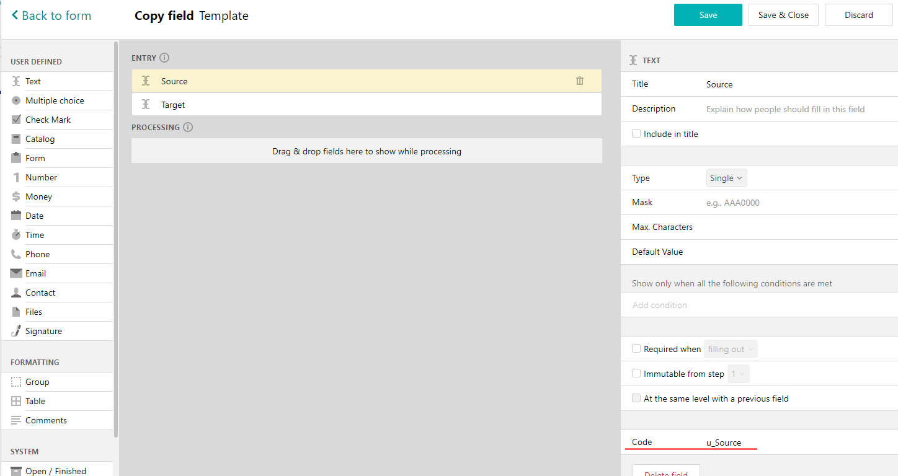
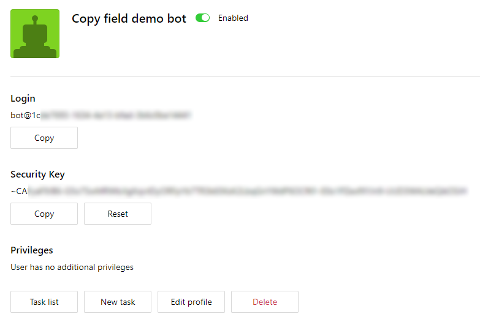
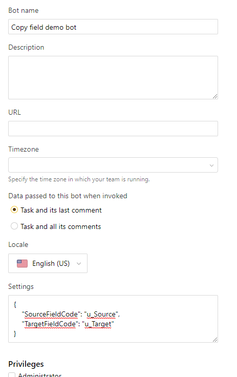
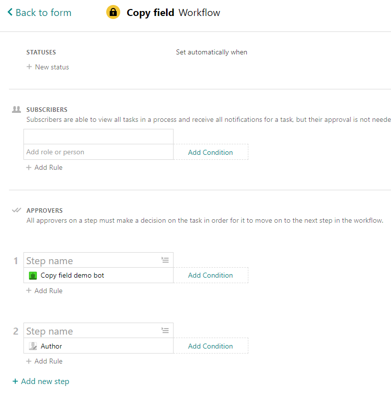
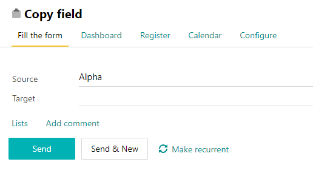

# Copy Field Yandex Bot

This demo bot will copy the content of one field to another in the Pyrus task.
Bot is intended to be deployed to Yandex as a cloud function, and to interact with Pyrus.

## The process of interaction

1. When a task is routed to the bot, Pyrus invokes a call to the AWS.
2. The bot gets parameters from the HTTP request from Pyrus.
3. The bot retrives codes of the form fields it will operate with.
4. It sends requests to Pyrus to get the form and the task from which it was invoked.
5. It generates a request to Pyrus to fill the field, approve the task and write a comment.
6. Yandex sends this request back to Pyrus after finishing the bot program code.

## How to use

Solution consists of two projects:

- CopyFileBot - a bot that will be deployed to Yandex.
- DemoRunner - a console application that can run a bot code locally without AWS.

| Mode                        | Description                                                                                                     |
|-----------------------------|-----------------------------------------------------------------------------------------------------------------|
| DemoRunner + Pyrus          | You can run and test the bot locally using DemoRunner without Yandex cloud having only the valid Pyrus account. |
| DemoRunner + Pyrus + Yandex | You can deploy the bot as a Yandex cloud function and interact from DemoRunner.                                 |
| Pyrus + Yandex              | You can deploy the bot as a Yandex cloud function, create a bot in Pyrus and place it on the step of approvals. |

## Environment setup

### DemoRunner setup

Modify the Program.cs file in DemoRunner project:

1. Set bot authorization.

Open the bot page in Pyrus and copy the following information to the corresponding places in Program.cs.

- id of the bot - a number from the end of URL.
- login.
- security key.

2. Set task id.

Open the task that was created on setup phase and copy id from URL - a number from the end of URL.

### Yandex setup

1. Go to Yandex cloud console https://console.cloud.yandex.ru
2. In the "Services" pane press "Cloud functions".
3. In the list of functions press "Create function" button on the right upper conner.
4. Give a name to the cloud function, and press "Create".
5. On the Editor page choose runtime type - select .NET Core, and press "Continue".
6. Press "ZIP archive" button.
7. Press "Choose a file" button and select zip-archive with project executables [1].
8. Enter Bots.CopyFieldBot.Bot in the "Entrypoint" fiels. It must contain namespace and class name of the bot (a tooltip is misconfusing).
9. Enter 59 in the "Timeout" field.
10. Go to "Overview" by selecting an item in the left menu.
11. Switch on the "Public function" button to be able to make requests without authorization.

[1] You can make project executables with .NET CLI with the following command: `dotnet publish -o path_to_deployment_folder`

### Pyrus setup

1. Create a form.

Add two text fields and give them the following codes: u_Source and u_Target.

2. Create a bot.

3. Set the bot URL

Go to the bot profile and enter the URL of the Yandex bot that you just created.

4. Set bot settings.

In the bot profile enter bot settings in json format. Names of the json elements are from *BotSetting.cs* file. Values are the codes of the fields that were created on step 1.

`{
    "SourceFieldCode": "u_Source",
    "TargetFieldCode": "u_Target"
}
`

5. Setup form workflow.

Return to the form that was created on step 2, go to Configure tab, then to Workflow.
Place the bot on the first step of approval list, and the author on the second like on the screenshot below.

6. Create a task.

Fill the form - enter any text in the source field.

## Running demo

### Expected results

If the setup procedures were done correctly, you'll see the following changes in the task:

- the target field is filled with content of the source field;
- comment was added;
- the task was approved by the bot;
- the task is to the second step.

### Using DemoRunner

Run the program from Visual Studio or CLI. 

### Using Pyrus workflow

1. Enter the task that you created during Pyrus setup.
2. Approve the task so it will move to stage 2.
3. Pyrus then will call the bot.
